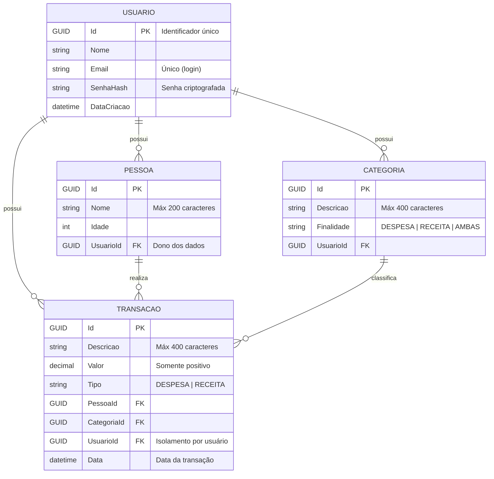

# Financial-Controller

## Objetivo:

Implementar um sistema de controle de gastos residenciais.
Deixar claro qual foi a lógica/função do que foi desenvolvido, através de comentários e documentação no próprio código. 

 
### Especificação:

Em linhas gerais, basta que o sistema cumpra os requisitos apresentados. É importante que o sistema seja separado entre webApi e front.

 
### Tecnologias (obrigatório):

Back-end: C# e .Net.
Front-end: React com typescript.
Persistência: Fica a sua escolha, mas os dados devem se manter após reiniciar o sistema. 

 
### Funcionalidades:

#### Cadastro de `Pessoas`: 

Deverá ser implementado um cadastro contendo as funcionalidades básicas de gerenciamento: criação, edição, deleção e listagem.

Em casos que se delete uma pessoa, todas a transações dessa pessoa deverão ser apagadas.

O cadastro de `Pessoa` deverá conter:

    Identificador (deve ser um valor único gerado automaticamente);
    Nome (texto com tamanho máximo de 200);
    Idade;

#### Cadastro de `Categoria`: 

Deverá ser implementado um cadastro contendo as funcionalidades básicas de gerenciamento: criação e listagem.

O cadastro de categoria deverá conter:

    Identificador (deve ser um valor único gerado automaticamente);
    Descrição (texto com tamanho máximo de 400);
    Finalidade (despesa/receita/ambas)

#### Cadastro de `Transações`: 

Deverá ser implementado um cadastro contendo as funcionalidades básicas de gerenciamento: criação e listagem.

Caso o usuário informe um menor de idade (menor de 18), apenas despesas deverão ser aceitas.

O cadastro de `Transação` deverá conter:

    Identificador (deve ser um valor único gerado automaticamente);
    Descrição (texto com tamanho máximo de 400);
    Valor (número positivo);
    Tipo (despesa/receita);
    Categoria: restringir a utilização de categorias conforme o valor definido no campo finalidade. Ex.: se o tipo da transação é despesa, não poderá utilizar uma categoria que tenha a finalidade receita.
    Pessoa (identificador da pessoa do cadastro anterior);

#### Consulta de totais por pessoa:

Deverá listar todas as pessoas cadastradas, exibindo o total de receitas, despesas e o saldo (receita – despesa) de cada uma.
Ao final da listagem anterior, deverá exibir o total geral de todas as pessoas incluindo o total de receitas, total de despesas e o saldo líquido.

#### Consulta de totais por categoria (opcional):

Deverá listar todas as categorias cadastradas, exibindo o total de receitas, despesas e o saldo (receita – despesa) de cada uma.

Ao final da listagem anterior, deverá exibir o total geral de todas as categorias incluindo o total de receitas, total de despesas e o saldo líquido.

## Especificações da Implementação
### Diagrama ER

